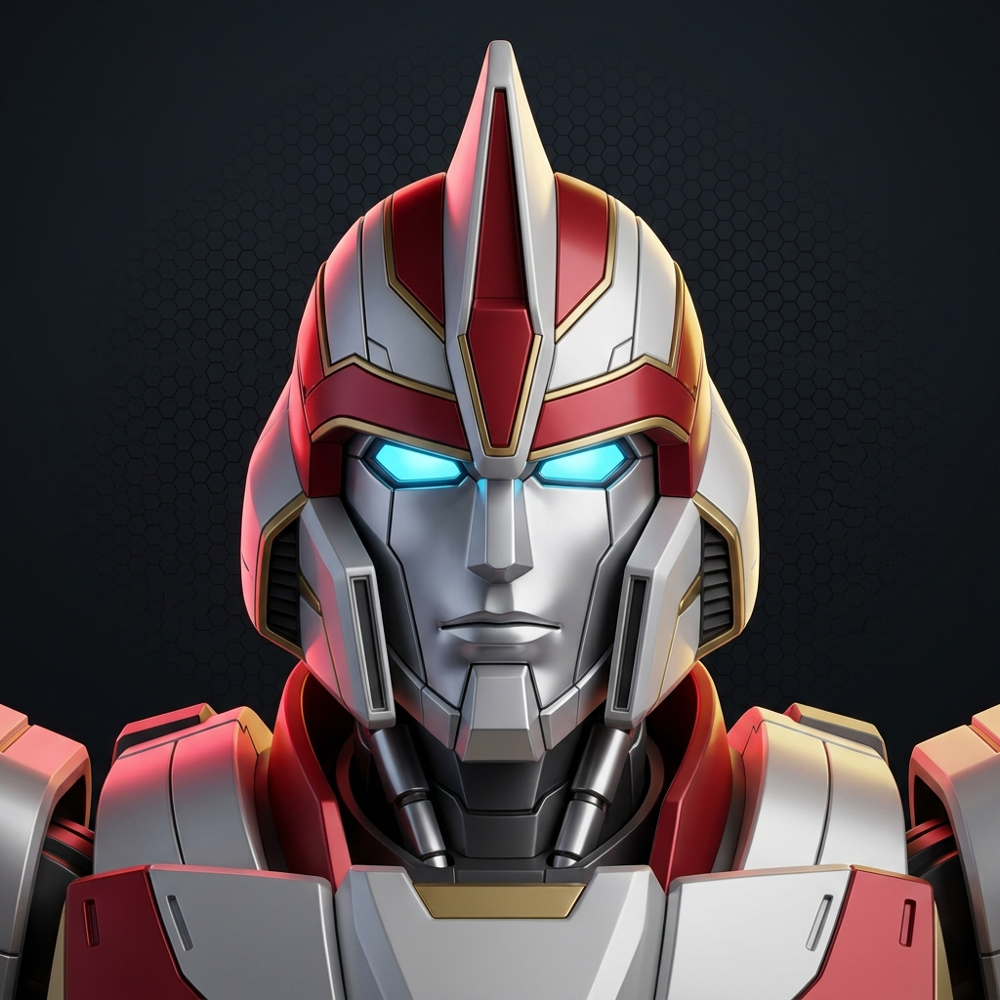
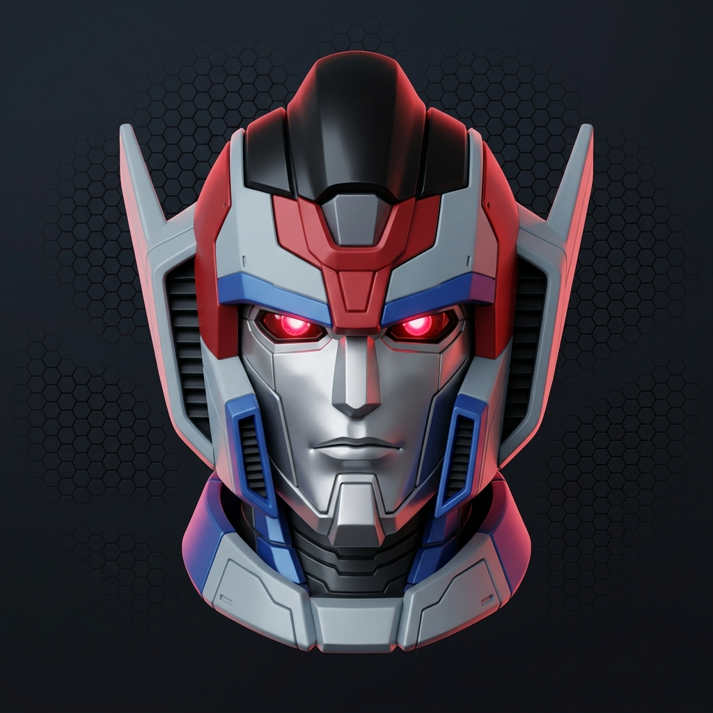
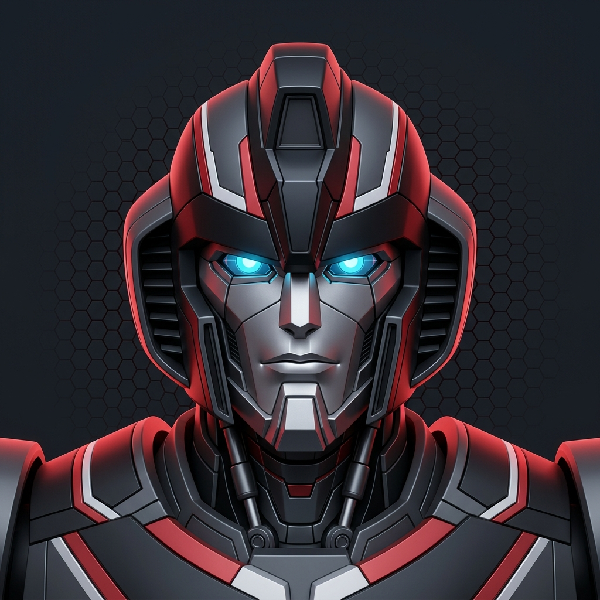
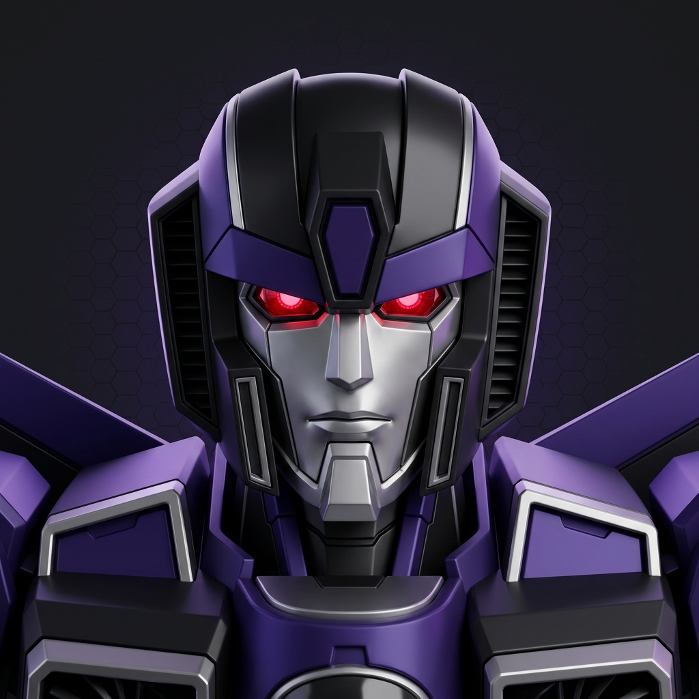
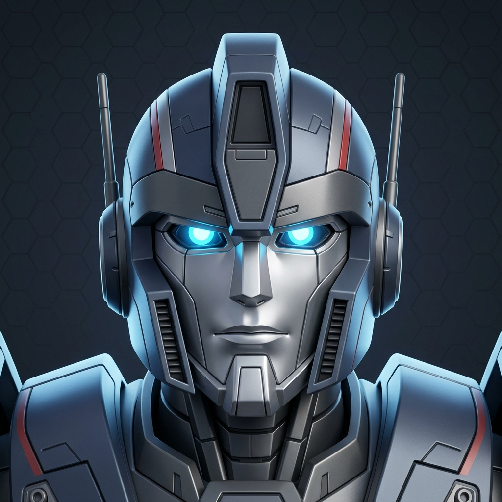
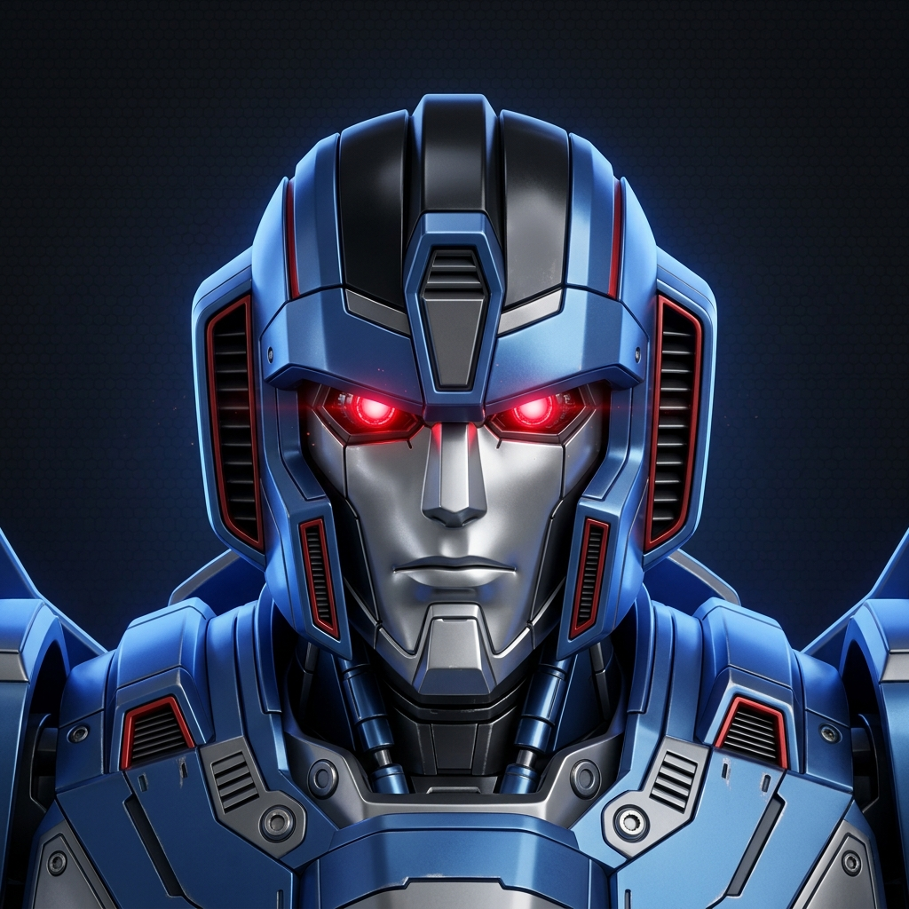
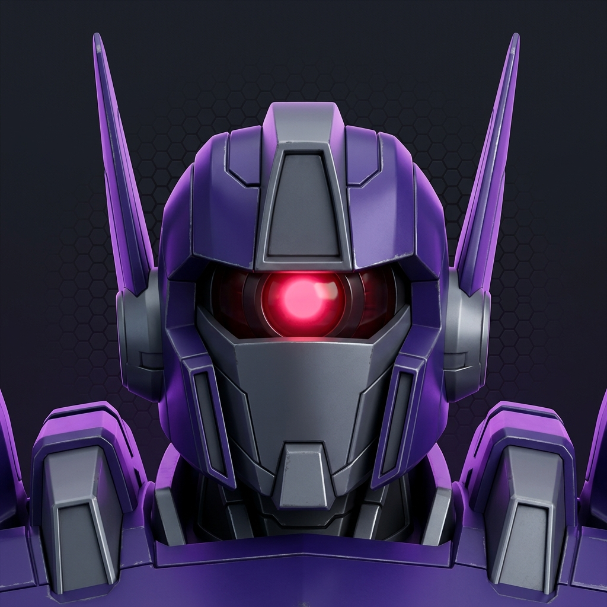
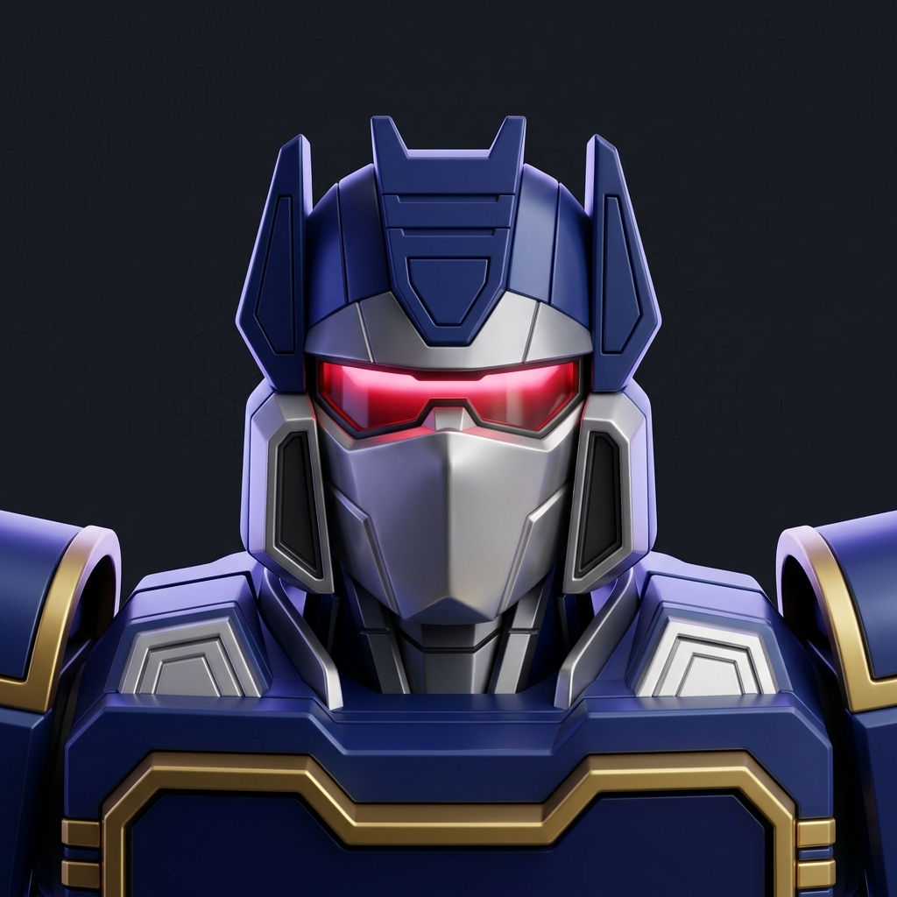
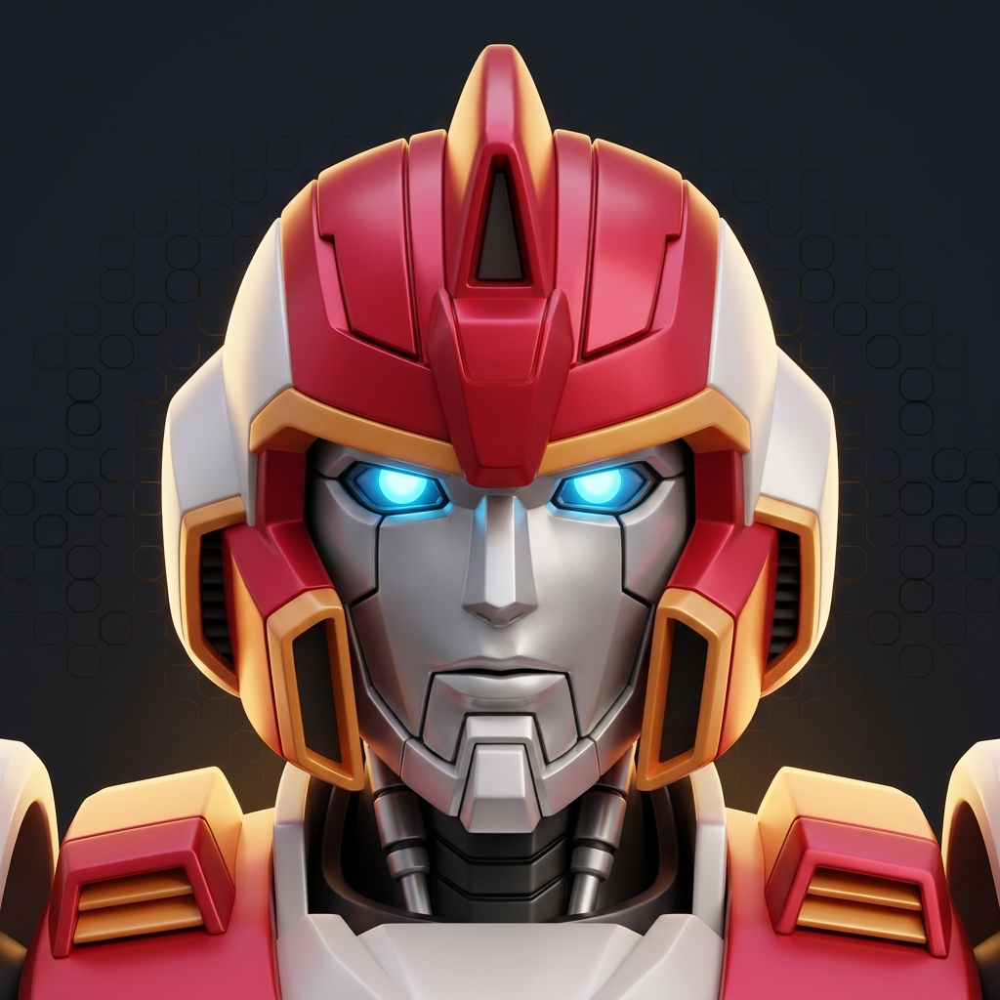
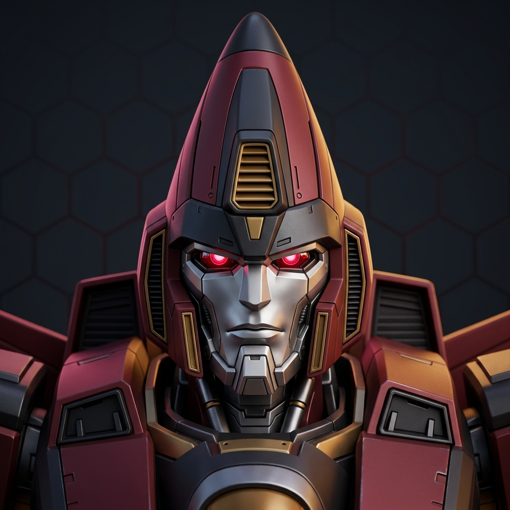

# Bots — choose your side

Agent personas and a Bun CLI for **Claude Code** and **Codex**. Choose the
**Autobots**, the **Decepticons**, or install both. The Autobot development team is the **Aerialbots**; the Decepticon development
team is the **Seekers**. Each has shared architecture and independent QA.

## Teams

| Role | Autobots | Decepticons |
| --- | --- | --- |
| Tech lead and dispatcher |  Silverbolt |  Starscream |
| Developer |  Air Raid / Air Raid-lite |  Skywarp / Skywarp-lite |
| Senior developer |  Skydive / Skydive-deep |  Thundercracker / Thundercracker-deep |
| Tester and verifier |  Ratchet / Ratchet-deep |  Shockwave / Shockwave-deep |
| Architect |  Prowl / Prowl-deep |  Soundwave / Soundwave-deep |
| Lead designer |  Fireflight / Fireflight-deep |  Thrust / Thrust-deep |
| UI implementation | Air Raid and Skydive | Skywarp and Thundercracker |

The Decepticons' first development team is the **Seekers**: Starscream,
Thundercracker, Skywarp, and Thrust. Developers work across frontend and backend.
**Soundwave** provides shared architecture and **Shockwave** independent QA,
outside the development team. Future teams can use the same specialists; no
second team is defined yet. Their software roles are adaptations of the characters.

The [Autobot definitions](autobots/README.md) and new
[Decepticon definitions](decepticons/README.md) are separate. The existing Seekers runtime
repository is not required or modified.

The Aerialbots comprise Silverbolt, Skydive, Air Raid, and Fireflight. **Prowl**
provides shared architecture and **Ratchet** independent QA outside that team.
UI implementation belongs to the developers on both sides.

The previous Optimus-led definitions are available in Git history. All legacy avatar
pictures remain preserved in `assets/avatars/`; see [visual references](assets/README.md).

## Choose your side

From this checkout:

```sh
bun src/bin.ts list --faction autobots
bun src/bin.ts list --faction decepticons
bun src/bin.ts install --all --faction autobots --harness claude --scope project
bun src/bin.ts install --all --faction decepticons --harness codex --scope project
```

With the package installed, use `bots` instead of `bun src/bin.ts`.
The command is `bots`. The package name is
`@flying-dice/bots`. The GitHub repository is still `flying-dice/autobots`;
this change does not rename the remote repository or publish a release.

`--faction autobots|decepticons|all` filters list, show, install, uninstall, and
status. Omitting it means `all`. Named installs need no faction flag:

```sh
bots install starscream skywarp soundwave shockwave --harness codex --scope user
bots install --all --faction all --harness all --scope user
bots status --faction decepticons --harness all --scope user
bots uninstall --all --faction decepticons --harness codex --scope project
```

Installing or uninstalling one faction leaves the other faction's agents alone.
Shared skills are common to both factions. `--all` includes them, including on
uninstall; omit `--all` and name bots to remove agents while keeping shared skills.

## Starting a session

Claude Code:

```sh
claude --agent silverbolt
claude --agent starscream
```

Use `examples/claude-settings.example.json` for an Autobot project default, or
`examples/claude-settings.decepticons.example.json` for Decepticons.

In Codex, mention `$silverbolt` or `$starscream` to adopt that dispatcher.
Both leads are installed as skills as well as custom agents. Teammates are
spawned by name; only the primary lead dispatches work. See
`examples/codex-config.example.toml` for subagent defaults and the nesting cap.
Project-scoped Codex definitions require a trusted project.

## Commands and options

| Command | Purpose |
| --- | --- |
| `list` | List bots with faction labels |
| `skills` | List the shared skills |
| `show <bot>` | Show a persona |
| `harnesses` | Show supported harness paths |
| `doctor` | Check whether user configuration directories exist |
| `install <bot...>` / `install --all` | Install selected bots |
| `uninstall <bot...>` / `uninstall --all` | Remove selected bots |
| `status` | Show installation presence and manifest version |

Install, uninstall, and status require both `--harness claude|codex|all` and
`--scope user|project`. Comma-separated harness names are supported; aliases
include `cc` and `openai`. `--dry-run` previews changes without writes.
`--skills` includes shared skills without selecting all bots.

The shared skills are `bot-avatar`, `pre-commit`, `clean-code-review`, `refactor`,
`ddd-hexagonal`, `repodoc-workflow`, and `cross-review`.

## Files and adapters

- Autobot personas: `autobots/<name>/AUTOBOT.md`.
- Decepticon personas: `decepticons/<name>/BOT.md`.
- Shared skills: `skills/<name>/SKILL.md`.
- Optional prompt overrides: `AUTOBOT.codex.md` or `BOT.codex.md` beside the definition.
- Claude agents: `.claude/agents/autobots/` or `.claude/agents/bots/`.
- Codex agents: `.codex/agents/`; skills: `.agents/skills/`.
- Claude skills: `.claude/skills/`.

User scope uses these directories beneath the home directory; project scope uses
the current directory. Claude receives original frontmatter and persona text.
Codex receives adapted prompts and TOML configuration. Model tiers map to
Astra (fable), Sol (opus), and Terra (sonnet); effort passes through. Analysis-only
bots receive a read-only sandbox.

Copy the template in the appropriate persona directory to add a bot. Directories
starting with `_` are ignored. Harness adapters live in `src/harnesses/`;
`src/bots.ts` loads both factions through the same catalog.

## Ownership and upgrades

The existing `autobots-manifest.json` filename is deliberately retained under
each harness root so earlier installations remain tracked. Reinstalling an item
removes paths it previously owned but no longer produces. Skill directories are
replaced wholesale.

`install --all` with no faction, or `--faction all`, prunes manifest items no
longer shipped by the catalog. Faction-filtered installs do not perform global pruning; selecting Autobots
also retires the superseded original team’s installed agents. Named installs never prune other bots. Uninstall uses recorded
paths plus the current plan. Dry runs leave the manifest untouched.

## Development and release

```sh
bun test
bun run typecheck
bun run build
bun run smoke:tarball
```

Build writes `dist/bots.ts`, embedding both factions and all shared skills. It
runs directly or over stdin with Bun. The tarball smoke test checks **committed
HEAD**, so commit changes before using it to validate a new package revision.

`bun run release patch|minor|major|x.y.z` checks the tree, runs tests/build,
bumps the version, commits, tags, and pushes. The release workflow attaches
`bots.ts` to the GitHub release. CI checks types, tests, bundle execution, and
installation from a repository tarball. No renamed release asset is available
until a new release is published.
